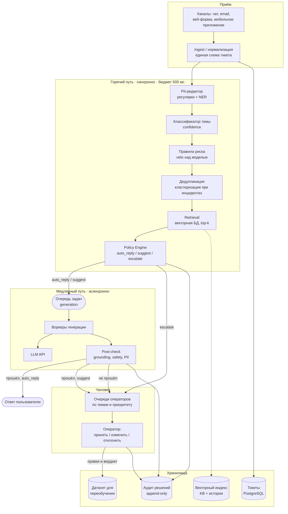
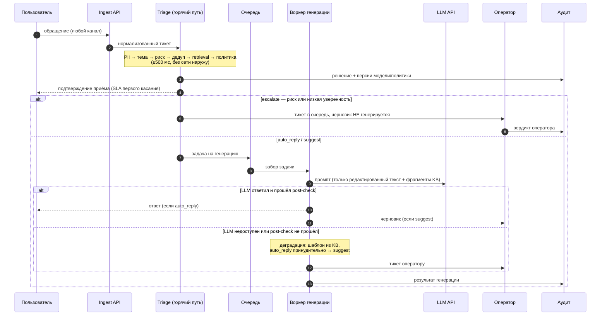
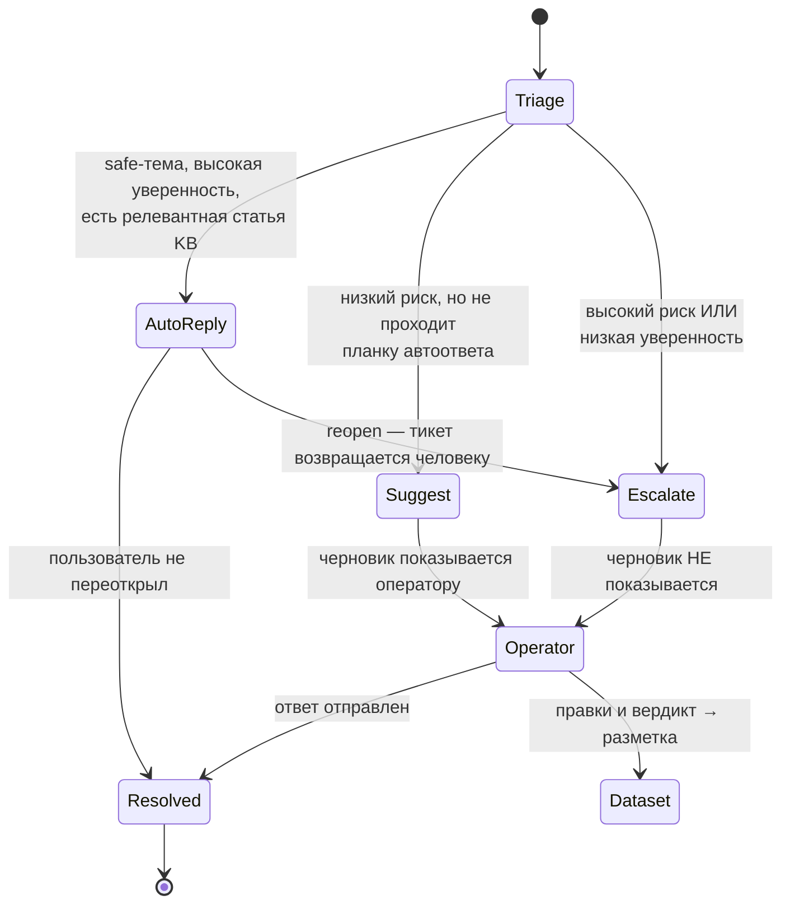

# Архитектура

## Определяющие ограничения

| Ограничение из ТЗ | Что оно диктует архитектуре |
|---|---|
| Классификация ≤ 500 мс | Синхронный «горячий» путь без LLM-вызовов |
| Всплески 10–20k тикетов / 10 мин (~33 RPS против ~2,3 RPS базовых) | Очередь между приёмом и генерацией; горячий путь масштабируется горизонтально |
| Автозакрытие не для всех категорий | Отдельный слой правил с правом veto над моделью |
| Корректная деградация при отказе LLM | Генерация физически отделена от маршрутизации; circuit breaker |
| Аудит автоматических решений | Immutable-лог решений с версиями модели и политики |
| Контроль стоимости LLM | LLM вызывается не для всех тикетов, а только после решения политики |

Главное следствие: **быстрый путь принятия решения и медленный путь генерации — это два разных сервиса с разными SLA**, а не два этапа одного запроса.

## Компоненты

## Поток данных: от тикета до ответа

## Синхронное и асинхронное

| Операция | Режим | Бюджет | Почему так |
|---|---|---|---|
| Нормализация, PII-редакция | sync | ~20 мс | Дальше без неё нельзя — PII не должен попасть в логи и внешние вызовы |
| Классификация темы | sync | ~30 мс | Определяет маршрут; лёгкая модель, CPU |
| Правила риска | sync | ~5 мс | Чистые правила, без I/O |
| Дедупликация | sync | ~50 мс | Ключ инцидент-режима: схлопывает всплеск до одного кластера |
| Retrieval | sync | ~100 мс | ANN-индекс; нужен политике для оценки «есть ли чем ответить» |
| Решение политики | sync | ~5 мс | Чистая функция |
| **Итого горячий путь** | **sync** | **~210 мс из 500** | Запас на сетевые хопы и хвосты |
| Генерация черновика | **async** | секунды–минуты | Внешний API, нестабильная латентность, стоимость |
| Post-check ответа | async | ~200 мс | Второй барьер перед пользователем |
| Отправка / постановка оператору | async | — | Не блокирует приём новых тикетов |

Пользователь получает подтверждение приёма сразу после горячего пути — SLA первого ответа (15 минут) закрывается с большим запасом даже когда генерация встала в очередь.

## Хранилища

| Хранилище | Что лежит | Почему отдельно |
|---|---|---|
| PostgreSQL (тикеты) | Тикет, статус, история переписки | Транзакционная запись, источник правды по SLA |
| Векторный индекс | Эмбеддинги статей KB и решённых тикетов | Другой паттерн доступа (ANN-поиск), другой цикл обновления |
| Аудит-лог (append-only) | Решение, версии модели и политики, сработавшие правила, скоры | Иммутабельность — требование аудита; нельзя смешивать с изменяемым состоянием тикета |
| Хранилище датасетов | Вердикты операторов, правки черновиков | Источник разметки для переобучения; см. [ml.md](ml.md) |
| Очередь (Kafka / SQS) | Задачи генерации | Буфер, который переживает всплеск и отказ LLM |

Аудит-лог отделён от базы тикетов сознательно: статус тикета меняется, а запись «почему система приняла такое решение в такой-то момент» меняться не должна никогда.

## Точки интеграции с внешними сервисами

| Интеграция | Где вызывается | Что при отказе |
|---|---|---|
| LLM API | Только воркер генерации | Circuit breaker → шаблон из KB → тикет оператору; автозакрытие выключается |
| Векторная БД | Горячий путь, retrieval | Пустой результат ⇒ низкий retrieval-скор ⇒ политика не даёт auto_reply |
| Каналы (чат/email/push) | Отправка ответа | Ретраи с backoff; тикет остаётся открытым |
| CRM / биллинг | Обогащение контекста оператора | Некритично, деградирует до тикета без контекста |

Все внешние вызовы, кроме векторной БД, вынесены из горячего пути. Это и есть механизм, которым удерживается бюджет 500 мс.

## Участие человека

Три уровня участия человека:

1. **Escalate** — модель не участвует в ответе вообще. Черновик сознательно не генерируется: он якорит оператора и в рискованной категории это опаснее, чем польза от подсказки.
2. **Suggest** — оператор видит черновик и правит его. Правки — основной источник обучающего сигнала.
3. **Auto-reply** — оператора нет в цикле, но есть отложенный контроль: reopen автоматически возвращает тикет человеку, а выборка автоответов уходит на ручной аудит (см. [monitoring.md](monitoring.md)).

## Запасные пути

| Отказ | Поведение | Что теряем |
|---|---|---|
| LLM API недоступен | Circuit breaker размыкается, черновик собирается из шаблона KB, auto_reply отключается глобально | Автоматизацию; маршрутизация продолжает работать |
| Модель классификации не отвечает | Fallback на правила по ключевым словам; всё, что не распознано, → общая очередь | Точность маршрутизации |
| Векторная БД недоступна | Retrieval возвращает пусто → политика не даёт auto_reply | Автоответы; suggest/escalate работают |
| Очередь переполнена (инцидент) | Дедупликация схлопывает кластер, генерируется один ответ на кластер | Индивидуальность ответа |
| Post-check не пропустил ответ | Тикет к оператору с пометкой причины | Автоматизацию по этому тикету |

Общий принцип деградации: **при любом отказе система теряет автоматизацию, но не теряет маршрутизацию и не отправляет непроверенный ответ пользователю.** Отказ всегда смещает решение в сторону человека, никогда — в сторону автоответа.

## Что из этого реализовано в PoC

| Компонент | В PoC | В целевой архитектуре |
|---|---|---|
| PII-редактор | Регулярки ([pii.py](../poc/src/support_triage/pii.py)) | + NER, политика хранения |
| Классификатор | TF-IDF + LogReg, обучается на старте | Дообученный энкодер, артефакт из реестра моделей |
| Правила риска | Реализованы ([policy.py](../poc/src/support_triage/policy.py)) | Те же, вынесены в конфиг с версионированием |
| Retrieval | TF-IDF-косинус по JSONL | Векторная БД с ANN-индексом |
| Policy Engine | Реализован полностью | Пороги из конфига, A/B по сегментам |
| Генерация | Шаблон / Claude за интерфейсом `Generator` | Асинхронные воркеры за очередью |
| Circuit breaker | Реализован ([generate.py](../poc/src/support_triage/generate.py)) | + метрики, полуоткрытое состояние, автовосстановление |
| Аудит | JSONL-файл ([audit.py](../poc/src/support_triage/audit.py)) | Append-only хранилище с ретенцией |
| Дедупликация | **Не реализована** — архитектурный дизайн | Кластеризация по эмбеддингам |
| Очередь, post-check | **Не реализованы** — архитектурный дизайн | Kafka/SQS + отдельный сервис проверок |
